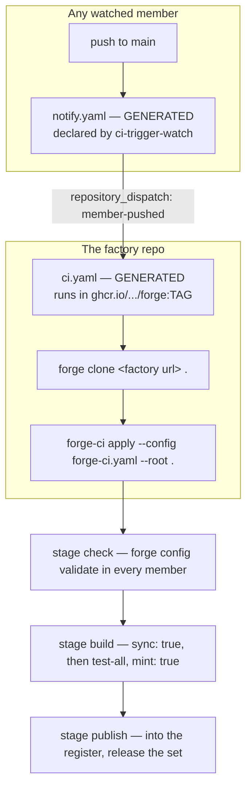

# The forge model, read from source

Read 2026-09-02. Source only: `forge.yaml`, `forge-factory.yaml`,
`forge-ci.yaml`, `hack/*.sh` and the workflow files. No markdown was read, per
instruction.

**Read at `origin/main`, not from the working tree.** The local checkouts are
stale: `forge-ci` 43 commits behind, `golden-register` 90, `golden-state` 53,
`golden-factory` 28, `forge-factory` 22, `forge-self-factory` 18, `forge` 15.
Files were read with `git show origin/main:<path>`, which touches nothing.

Toolchain installed locally: `forge v0.45.9`. The image the pipelines run is
`ghcr.io/alexandremahdhaoui/forge:v0.45.36`.

## The three tools

| Tool | Owns | Config |
|---|---|---|
| `forge` | how one repo builds, tests and runs | `forge.yaml`, per repo |
| `forge-factory` | what the workspace is made of, and every version | `forge-factory.yaml`, workspace root |
| `forge-ci` | the pipeline across every member | `forge-ci.yaml`, workspace root |

`forge` delegates: `forge factory ...`, `forge ci ...`, `forge register ...`.
`forge clone <factory-url> <dir>` stands a whole workspace up from nothing.

## The central inversion

**A repo cannot be built alone.** From the generated `ci.yaml` header:

> There is no per repo workflow. A repo cannot be built alone here: a lone
> checkout has no sibling repos, no workspace go.work or root Cargo.toml, and no
> go.mod at all, because the manifests are generated and gitignored.

So `go.work`, the root `Cargo.toml`, `pnpm-workspace.yaml`, every `go.mod` and
even each member's `.envrc` are generated by `forge-factory` and gitignored.



## Everything is generated, including the CI

This is the part my first pass got wrong. There is no hand-written workflow
anywhere. `forge-ci.yaml` declares a `ci-compute-github` engine holding the repo,
the container, the bootstrap command, the secrets and the list of workflows.
`forge-ci apply` converges the actual files. A hand-edited workflow drifts back.

Both `golden-factory` and `forge-self-factory` are on this pattern at
`origin/main`. Each ships exactly two workflow files, `ci.yaml` and
`release.yaml`, and both are generated.

`golden-factory`'s own comment records what the hand-written era cost:

> This workspace never had one: pipeline.yaml was hand-written, installed
> forge@v0.44.2 from the proxy, and called `forge clone`, a verb that version
> does not have. Fifty-three runs, none green.

## The job runs in the toolchain image

No `go install` of the toolchain in CI. The job declares
`container: ghcr.io/alexandremahdhaoui/forge:<tag>` and `forge` is already on
PATH. The tag is never typed:

- `forge-factory.yaml` declares `toolchain.image` with a `ref` and a `track`.
- `forge-factory sync` resolves the track and writes `.forge/toolchain-image`.
- `forge-ci.yaml` points `spec.containerFile` at that file.

The bootstrap step is one line, because a container carries tools and not
members: `forge clone git@github.com:<owner>/<factory>.git .`

A tool store cache is restored and saved around the run, keyed by the hash of
its own contents.

## forge-factory.yaml

Sections observed at `origin/main`:

- **`repos`** — every member, with `languages: [rust]` where it has code. A
  member with no language generates no manifest, which is how spec, state and
  register repos stay plain.
- **`register`** — the register repo URL. Versions resolve from it.
- **`dependencies` / `devDependencies`** — one list per language. A Rust entry is
  written verbatim into `[workspace.dependencies]`; `wraps:` carries the inline
  table when features are needed. A `pin:` with `mode`, `reason` and `expires`
  freezes a version deliberately. An `acknowledge:` entry records a reviewed
  advisory with its reasoning.
- **`toolchain.binaries`** — standalone Go tools provisioned into `.forge/bin`.
- **`toolchain.image`** — the container the pipelines run in. New.
- **`toolchain.runtimes`** — pinned language runtimes the factory provisions and
  exposes on `.forge/bin`: `go`, `rust`, `python`, `typescript`, `pnpm`, `uv`,
  `jre`, `openapi-generator`. This is why a CI job needs nothing preinstalled
  beyond a POSIX base and a C toolchain. New.
- **`engines`** — one `factory-lang-*` per language.
- **`state`** — the state engine and the repo it writes.

`forge-factory` at `origin/main` also ships `factory-fetch`, `factory-install`
and `factory-runtime-archive`, which are what provision those runtimes.

## forge-ci.yaml

- **`repos`** — every runnable-bearing member, so a minted revision pins each sha.
- **`managers`** — `local`, and `github` with `tokenEnv: FORGE_CI_GITHUB_TOKEN`.
  A token named by env, supplied at bootstrap. Not a deploy key, and a run never
  holds it.
- **`engines`** by `type`: `compute`, `state`, `trigger`, `promotion`, `artifact`.
- **`targets`** — an alias mapping a `forge` command to a set of repos.
- **`stages`** — ordered, each with a `promotion`.

Available `forge-ci` engines at `origin/main`:

```
ci-artifact-container   ci-artifact-release   ci-compute-github
ci-compute-local        ci-gate-manual        ci-manager-dryrun
ci-manager-github       ci-manager-local      ci-promotion-all
ci-state-git            ci-trigger-watch
```

## Rules the current source states outright

1. **Check before you build.** A `check` stage runs `forge config validate` in
   every member first, so a typo in a `forge.yaml` is reported where it was made
   rather than inside whichever stage meets it.
2. **`sync: true` on the build substage.** The workspace converges before the
   build: manifests, then the dependency closure. `lock` became its own verb, so
   `sync` alone stopped resolving the closure. A multi-repo pipeline that never
   syncs is **refused by `forge-ci validate`**.
3. **Mint after the gate.** Minting first hands a broken build a revision that
   propagates.
4. **No `self` stage.** Self-convergence is a property of `apply` itself: every
   run reconciles the declared surface, settles drift with a scoped push, and
   stops superseded. `pushBranches: [main]` re-fires the superseding run. A
   `self` stage running `forgeCI: bootstrap` used to stand there and it surfaced
   credential realization inside CI.
5. **The watch list declares its own notify workflow.** `ci-trigger-watch` takes
   a `watch:` list and a `notify:` block with owner, factory, event type and
   secret, so member notify workflows are generated and the two can never
   disagree. Watching a repo the pipeline itself writes never settles, so the
   register and state repos stay out of the list.
6. **A repo must not track a file it also ignores.** `hack/tracked-and-ignored.sh`
   runs before the file comparison, because such a repo can never settle.
7. **Committed generated code must be checked against its source.** `golden-rust`
   gained a `generated` test stage. The release gates on a `-dirty` revision, but
   that revision is measured before any stage runs, so what a build regenerates
   is otherwise invisible.
8. **A failing run reports itself.** `reportFailure: true` opens a GitHub issue,
   once, because a dispatched run has no audience.

## A Rust member repo

From `golden-rust/forge.yaml` at `origin/main`:

- forge ships no native Rust engines. Every stage wraps cargo through
  `forge://generic-builder` and `forge://generic-test-runner`.
- Test stages: `lint` (`cargo clippy -p <crate> --all-targets -- -D warnings`),
  `format-check` (`cargo fmt --all -- --check`), `unit` (`cargo test -p <crate>`),
  and `generated` (`hack/generated-check.sh`).
- Clippy is scoped `-p <crate>`, never the workspace, so generated crates stay
  out of lint standards.
- Windows cross-compile is a `generic-builder` step running
  `cargo build --release --target x86_64-pc-windows-gnu`, then a copy into
  `$WIN_OUTPUT_PATH`. Never `go://go-build`.
- A trailing `factory:` block names the `crate:` and any `cargoMembers:` that are
  cargo workspace members but not repos.
- `.gitignore` carries `target/`, `/.forge/`, `/tmp/` and **`/.envrc`**, with the
  comment that forge-factory materialises it.
- The only workflow in the repo is the generated `notify.yaml`.

`Cargo.toml` uses `dep.workspace = true` for anything the factory governs.

## Hard rules extracted

1. Never hand-write `go.work`, the root `Cargo.toml`, a member's manifest, or a
   member's `.envrc`. All are generated and gitignored.
2. Never hand-write a workflow. Declare it in `forge-ci.yaml` and let `apply`
   converge it.
3. A member repo's workflow notifies. It never builds.
4. Mint the revision after the gate, never before.
5. The factory repo is the only place workspace files are edited.
6. Read `origin/main`, not the working tree. Local checkouts go stale fast.
