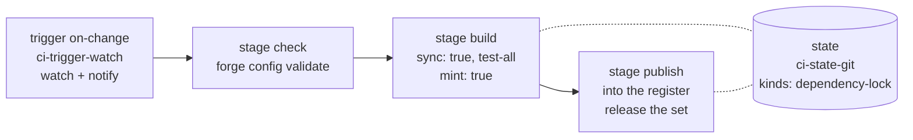

# What this workspace needs

Rust only. Everything follows what `golden-factory` and `forge-self-factory`
carry at `origin/main` today. See `00-forge-model.md`.

Name is **qod**. The GitHub org is not decided. No repository exists yet.

## The eight repos

| Repo | Lang | Holds |
|---|---|---|
| `qod-factory` | none | `workspace/forge-factory.yaml`, `workspace/forge-ci.yaml`, `workspace/CLAUDE.md`, `workspace/FOLLOWUP.md`. The only place workspace files are edited. |
| `qod-state` | none | revisions and runs. Written by the pipeline every run. |
| `qod-register` | none | version tracks. Written by the publish stage. |
| `qod-spec` | none | specs and test vectors |
| `qod-core` | rust | pure parsing and planning, gated by `purity.sh` |
| `qod-app` | rust | adapters, controllers, drivers, generated cells |
| `qod-engines` | go | forge-dev generator engines, one `cmd/` per engine |
| `qod-configgen` | go | config generator, Rust only |

State and register stay out of the `ci-trigger-watch` list. The pipeline writes
both on every run, so watching them would never settle.

## Layout after `forge clone`

```
<workspace-root>/
  forge-factory.yaml        generated, gitignored
  forge-ci.yaml             generated, gitignored
  Cargo.toml                generated, gitignored, virtual workspace
  .forge/bin/               provisioned toolchain and runtimes
  .forge/toolchain-image    generated, holds the container tag
  CLAUDE.md                 placed from the factory
  FOLLOWUP.md               placed from the factory
  <factory repo>/
  <state repo>/
  <register repo>/
  <data repo>/
```

Today's `docs/`, `notes.md` and `FOLLOWUP.md` live at this workspace root. They
belong in the factory repo's `workspace/` directory. Not moved yet.

## Approved crates

Vetted by the user on 2026-09-02. Nothing else enters `dependencies.rust`
without asking again.

| Crate | Role | Stars | Notes |
|---|---|---|---|
| `reqwest` | HTTPS to cytrus.cdn.ankama.com | 11 808 | golden already governs it, same wrap: `default-features = false, features = ["json", "rustls"]` |
| `rustls` | TLS | 7 590 | declared explicitly even though reqwest embeds it |
| `serde` | derive | 10 793 | `features = ["derive"]` |
| `serde_json` | read cytrus.json, write our output | 5 633 | |
| `clap` | CLI | 16 682 | |
| `thiserror` | typed library errors, CLAUDE.md §6 | 5 530 | |
| `anyhow` | propagation in binaries, CLAUDE.md §6 | 6 642 | |
| `lz4_flex` | LZ4 block decode in UnityFS | 615 | replaces the plan to reimplement LZ4 |
| `flatbuffers` | manifest reader | 26 423 | needs `flatc`, see below |
| `mockall` | mocks from traits, dev-dependency only | 1 834 | |

Seven of these ten are already in golden's `dependencies.rust`, with wraps we can
copy verbatim. `rustls`, `lz4_flex` and `flatbuffers` are new to the fleet.

## Still reimplemented

- **The UnityFS bundle, SerializedFile and type tree parser.** This is the core
  of the data repo. The only Rust option, `unity-asset`, has 11 stars.
- **LZMA**, if the bundles need it. Deferred until the spike says. `lzma-rs` has
  not been pushed since 2024-07.

## FlatBuffers without flatc

Decided 2026-09-02. `factory-runtime-archive` is a hardcoded table holding
`jre`, `pnpm`, `uv` and `openapi-generator`. It ignores `Params`. flatc is not in
it and adding it means an upstream change or a provider engine.

Neither is needed. A forge-dev generator is a pure function from a normalized
model to files, so `qod-engines/cmd/flatbuffers-rust` reads `manifest.fbs` from
the cell directory, parses the schema subset we use, and emits
`zz_generated_manifest.rs`. The emitted accessors call the `flatbuffers` crate
runtime: `Table::new`, `get`, `ForwardsUOffset`, `Vector`. That is what flatc
emits too.

## How an engine is built

From `forge-dev-codegen` at `origin/main`. One engine is one directory:

```
cmd/<engine>/
  forge-dev.yaml         kind: mcp-server, one tool named generate
  spec.openapi.yaml      GenerateInput and GenerateOutput
  handlers.go            the logic
  zz_generated.*         MCP wiring, emitted by forge-dev
```

Two build steps per engine:

```yaml
- name: gen-<engine>
  src: ./cmd/<engine>
  engine: forge://forge-dev
- name: <engine>
  src: ./cmd/<engine>
  dest: ./build/bin
  engine: forge://go-build
```

Test stages: `forge://go-lint`, `forge://go-test`, and `generated` running
`hack/generated-check.sh`. Format last, after every generator, or a fresh build
leaves output unformatted.

The repo declares `factory: manifest: committed` so a `forge://` URI resolves it
standalone.

A consumer cell names the engine:

```yaml
generator: forge://github.com/<org>/qod-engines/cmd/flatbuffers-rust
```

`GenerateInput` carries `name`, `kind`, `language`, `surface`, `openapiSpec`,
`checksum` and `srcDir`. The engine reads its schema from `srcDir` and stamps
`checksum` into the header.

## Test stages for a Rust member

Copy `golden-rust` at `origin/main`:

```yaml
test:
  - name: lint
    runner: forge://generic-test-runner
    spec:
      command: cargo
      args: ["clippy", "-p", "<crate>", "--all-targets", "--", "-D", "warnings"]
  - name: format-check
    runner: forge://generic-test-runner
    spec:
      command: cargo
      args: ["fmt", "--all", "--", "--check"]
  - name: unit
    runner: forge://generic-test-runner
    spec:
      command: cargo
      args: ["test", "-p", "<crate>"]
```

Add a `generated` stage once anything is generated into the repo.

Windows cross-compile is a `generic-builder` step targeting
`x86_64-pc-windows-gnu`, copying into `$WIN_OUTPUT_PATH`. Both targets are
already installed on this machine.

## Pipeline shape

Trimmed from golden's `forge-ci.yaml` at `origin/main`. Rust only, one product
repo, no multi-language matrix.



Engines needed:

- `ci-manager-local` and `ci-manager-github` with `tokenEnv`
- `ci-compute-local` as `here`, `ci-compute-github` as `actions` with
  `containerFile: .forge/toolchain-image`
- `ci-state-git` with `kinds: [dependency-lock]`
- `ci-trigger-watch` with `watch:` and `notify:`
- `ci-promotion-all`
- `ci-artifact-release`, once there is a binary worth distributing

No `self` stage. Self-convergence is a property of `apply`.

Secrets: `FORGE_CI_GITHUB_TOKEN` and `FORGE_CI_DISPATCH_TOKEN`.

## Order of work, once names are decided

1. Create the factory repo with `forge.yaml`, `hack/factory-check.sh`,
   `hack/tracked-and-ignored.sh`, `.gitignore`, and `workspace/` holding the two
   yaml files plus `CLAUDE.md` and `FOLLOWUP.md`. No members with a language yet.
2. Create the empty state and register repos.
3. `forge clone <factory url> .` into a clean directory. **This is the
   checkpoint.** Nothing after it works if it fails.
4. Declare the `actions` compute engine and the `github` manager, supply the two
   tokens, run `forge-ci apply`, confirm `ci.yaml` and `release.yaml` are
   generated on the factory checkout.
5. Move `docs/`, `notes.md` and `FOLLOWUP.md` into the factory's `workspace/`.
6. Add the data repo as a `rust` member.

## Open questions

1. **The tool name.** Undecided. Everything else waits on it.
2. **Organisation and repo layout.** Undecided. One repo per language and per
   domain is the workspace convention, but the split for this project is not set.
3. **The flatc problem.** Blocks the data repo. Three options above.
4. **Toolchain image.** golden runs `ghcr.io/alexandremahdhaoui/forge`. Does this
   workspace reuse it, or does it need its own with `flatc` added?
5. **Register.** golden and forge-self each have their own. Does this workspace
   get a third, or resolve from an existing one?
