# Dofus 3 overlay research: synthesis

Date: 2026-09-02. Every claim below links to a source in the topic files.

## Conclusion first

There are exactly three ways to talk to a Dofus 3 client. Two of them are
banned. Only one is safe.

| Approach | Status | Verdict |
|---|---|---|
| Modify the client (BepInEx, MelonLoader, IL2CPP injection) | Ankama bans automatically | Dead. The main open source project doing this shut down. |
| Read or proxy the network (MITM, sniffer) | New detection routine shipped early 2026 | Dead. Ban waves. |
| Stay outside the client (window management, screen capture, synthetic input) | Tolerated for years, some tools are Ankama partners | This is the lane. |

The overlay you described fits in lane 3, but only partly. Window switching
and reading the screen are fine. Automating clicks and dialogue skipping is
the exact behaviour Ankama's detection targets, whatever technique produces it.

## The three real levers

The project goal is "fewer clicks on the non-fun part". Three levers give most
of that value with almost no risk.

1. **`/travel X Y`**. Dofus 3 has a built-in autopilot chat command, free for
   subscribers level 10+. Sending one line of text replaces a whole map walk.
   Existing tools already do this by clipboard paste. No pathfinding needed.
2. **Game data is fully available offline.** Quests, maps, items, NPC dialogue
   and French text all ship as extractable JSON, updated automatically on every
   patch. You never need to read the client to know what a quest asks for.
3. **Window management is legal.** Multi-account organizers that only reorder
   Windows windows have been tolerated for over a decade.

## The multi-account dream, honestly

You want 8 characters with 7 windows closed. That is not possible without
replacing the client, because the server only knows about connected clients.
The only projects that do it run their own protocol-level client. That is a
bot by any definition, it is what the January 2026 detection routine targets,
and it is outside your stated scope.

What is achievable: cut per-window cost and make one keystroke drive the group.
See `06-multi-account.md`.

## Architecture the research points to

```mermaid
graph TD
    subgraph outside["Outside the client, safe"]
        OV[Overlay window<br/>transparent, click-through]
        CAP[Screen capture + OCR<br/>read state]
        INP[Synthetic input<br/>SendInput on focused window]
        WM[Window manager<br/>enumerate, focus, order]
    end
    subgraph data["Local data, no client contact"]
        DB[(Quest / map / i18n JSON<br/>from doduda releases)]
        RT[Route planner<br/>emits /travel commands]
    end
    subgraph banned["Do not do this"]
        BEP[BepInEx plugin]
        MITM[Packet proxy]
        HDL[Headless protocol client]
    end
    DOFUS[Dofus 3 client]

    DB --> RT --> OV
    CAP --> OV
    OV --> INP --> DOFUS
    WM --> DOFUS
    DOFUS -.pixels.-> CAP
    BEP -.banned.-> DOFUS
    MITM -.banned.-> DOFUS
    HDL -.banned.-> DOFUS

    style banned fill:#3a1111,stroke:#a33
    style outside fill:#11291a,stroke:#3a7
```

## Where the risk actually sits

Ankama does not detect tools. It detects behaviour. Reported detection signals:
clicks landing on the same pixel repeatedly, action timing that is too regular,
24/7 activity with no breaks, and client memory modification. An overlay that
moves the real cursor with human-like jitter and waits on screen state, driven
by a human pressing a key, produces none of those signals. An overlay that runs
a quest end to end while you watch produces all of them.

That is the design line for this project: **the human presses the key, the
overlay does the boring step, then stops.**

## Topic files

- `01-client-integration.md` — how each technique reads the Dofus 3 client
- `02-existing-projects.md` — what already exists on GitHub, and how alive it is
- `03-rules-and-ban-risk.md` — Ankama's rules and what actually gets banned
- `04-input-automation.md` — sending clicks and keys on Windows, and the limits
- `05-game-data-and-quests.md` — where quest and map data comes from
- `06-multi-account.md` — the 8 accounts problem
