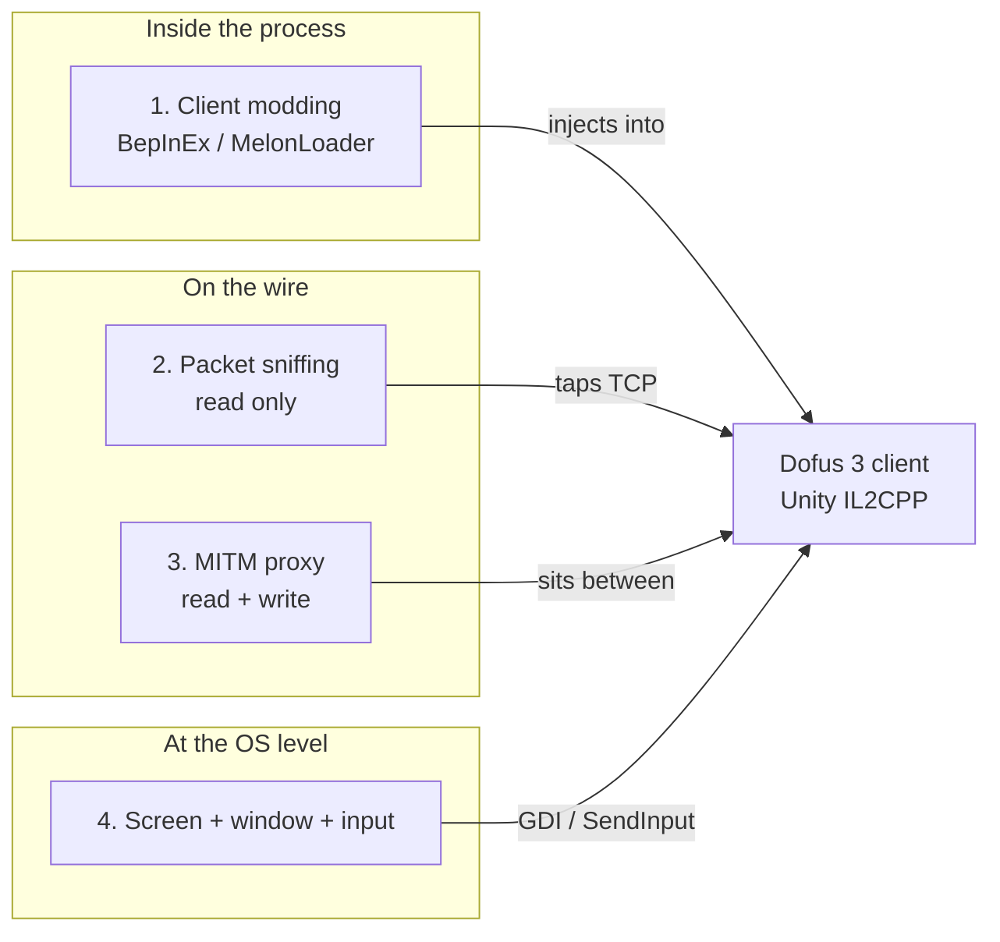

# How tools integrate with the Dofus 3 client

## What Dofus 3 is, technically

Dofus 3 shipped 2024-12-03. It replaced the Flash and AIR based Dofus 2 with a
Unity client compiled with IL2CPP. Consequences:

- Class and method names are obfuscated in the shipped binary.
- The network protocol moved from Dofus 2 custom binary messages to
  **Protocol Buffers**, and the proto message names are obfuscated too.
- Every Dofus 2 era tool broke. `bot4dofus/Datafus`, the reference protocol and
  data repo of the Dofus 2 era, is marked deprecated since the Dofus 3 release.
- Game files are distributed through Ankama's **cytrus** CDN, reachable without
  the launcher.

## The four integration techniques

### 1. Client modding, BepInEx IL2CPP

The most powerful technique. A .NET plugin loads inside the Unity runtime and
reads the game's own objects directly.

`Dofus-Batteries-Included/DBI.Plugins` is the reference implementation. Its
README documents the whole approach: install BepInEx Unity IL2CPP into the game
folder, run `Dofus.exe` once to generate `BepInEx/interop/`, build against those
interop assemblies, pin the plugin to the `build-guid` in
`Dofus_Data/boot.config` because a plugin built for one game build crashes on
another.

Its core plugin gave you: a message listener over every event the game receives,
a player state object, persistent key-value storage, configuration UI, and the
ability to add real widgets to the game's own top-right menu. The `TreasureSolver`
plugin used it to show treasure hunt clues in-game.

Its own note on why messaging was the chosen route is telling: it is "the most
reliable way to get the current state of the game without having to deal with
the obfuscated symbols of the game".

**This project is discontinued.** Ankama stated that modifying the client with
MelonLoader or BepInEx is prohibited and that players using such clients are
banned automatically.

The same organisation's `DDC` uses the identical injection trick, but only to
dump data offline, not to play. See `05-game-data-and-quests.md`.

### 2. Packet sniffing, read only

Read TCP traffic without touching it. Dofus 2 era tools like
`MojoCC/dofus-packet-sniffer` and `AxelConceicao/dofus-sniffer` used Python plus
Scapy on port 5555. For Dofus 3 the only live attempt found is
`AlpaGit/bubble-sniffer-zig`, a Unity sniffer in Zig, marked work in progress.

The hard part is no longer capture, it is decoding. You need `Il2CppDumper` to
dump the client, `protodec` to recover proto definitions, then
`RuinedYourLife/dofus-deobfs` to map obfuscated proto files onto clear ones from
`LuaxY/dofus-unity-protocol-builder`. That last repo now warns it is outdated
and may not work with the current game version.

So: a full toolchain exists, it is fragile, and it breaks on every patch.

### 3. MITM proxy, read and write

`viclew1/VLDofusBot` and `JustNao/Karrelage` are the known examples, both Dofus 2
era. A MITM sits between client and server and can rewrite messages, so it can
act without the client ever knowing.

Early 2026 Ankama activated a detection routine on the Unity client specifically
targeting MITM and injection, roughly one year after the Dofus 3 launch. Ban
waves followed in January 2026. Community write-ups note that surviving a wave
proves nothing, because flags accumulate for weeks before a batch sanction.

### 4. OS level, outside the process

Nothing touches the game. You enumerate its windows, capture pixels, and send
input the same way a mouse does.

This is what every currently maintained multi-account tool does. `ROrganizer`
states it plainly: the app "ne touche pas à Dofus : elle ne le lit pas, ne le
modifie pas, ne lui envoie rien" — it listens for your hotkeys and brings the
right window forward. It writes only its own config to AppData.

`DofusHuntHelper` sits one step further: it reads a `/travel` command from the
clipboard, moves the mouse to the game chat, pastes, and presses Enter twice.
No OCR yet, that is on its roadmap. It originally drove an Arduino to produce
hardware-level input, and later added a pure software mode.

## What this means for the project

The only durable integration surface is number 4. Everything else is either
already banned or one patch away from breaking.

The good news: `/travel` makes technique 4 much stronger than raw pixel botting.
You do not need to see the map or compute a path. You need to type one line.

## Sources

- [Dofus-Batteries-Included/DBI.Plugins](https://github.com/Dofus-Batteries-Included/DBI.Plugins)
- [Dofus-Batteries-Included/DDC](https://github.com/Dofus-Batteries-Included/DDC)
- [bot4dofus/Datafus](https://github.com/bot4dofus/Datafus)
- [AlpaGit/bubble-sniffer-zig](https://github.com/AlpaGit/bubble-sniffer-zig)
- [RuinedYourLife/dofus-deobfs](https://github.com/RuinedYourLife/dofus-deobfs)
- [LuaxY/dofus-unity-protocol-builder](https://github.com/LuaxY/dofus-unity-protocol-builder)
- [viclew1/VLDofusBot](https://github.com/viclew1/VLDofusBot)
- [JustNao/Karrelage](https://github.com/JustNao/Karrelage)
- [Loulouw/ROrganizer](https://github.com/Loulouw/ROrganizer)
- [Sato-Isolated/DofusHuntHelper](https://github.com/Sato-Isolated/DofusHuntHelper)
- [Bot Dofus ban : risque et détection en 2026](https://botify.vip/blog/bot-dofus-ban-detection/)
- [Vague de bans Dofus janvier 2026](https://forum.cheat-gam3.com/ams/vague-de-bans-dofus-janvier-2026-quel-bot-utiliser-pour-survivre-%C3%A0-lanti-cheat.134/)
