# Ankama rules and ban risk

## What the terms say

The Ankama terms of use commit you to not creating, using or distributing any
program not distributed by Ankama that could modify account characteristics,
harm the servers, or infringe the company's interests. Automation software and
client modification software fall under this. Third-party tools also must not
be advertised in game or on the official forum.

Direct fetch of `account.ankama.com/fr/tou` returns 403 to automated clients, so
the wording above comes from secondary sources. **Read the page yourself in a
browser before making any public claim about legality.**

## What Ankama actually enforces

The written rule is broad. Enforcement is narrow and inconsistent. The gap is
where every existing tool lives.

```mermaid
graph TD
    Q{What does the tool touch?}
    Q -->|Game process memory or files| BAN[Automatic ban<br/>BepInEx, MelonLoader, cheat engines]
    Q -->|Network between client and server| BAN2[Targeted since early 2026<br/>MITM, sniffers, custom clients]
    Q -->|The Windows window only| OK[Tolerated for 15+ years<br/>organizers, window switchers]
    Q -->|Synthetic mouse and keyboard| GREY{Behaviour test}
    GREY -->|One action per human keypress| OK2[In practice tolerated]
    GREY -->|Unattended loops, 24/7| BAN3[This is what detection catches]

    style BAN fill:#3a1111,stroke:#a33
    style BAN2 fill:#3a1111,stroke:#a33
    style BAN3 fill:#3a1111,stroke:#a33
    style OK fill:#11291a,stroke:#3a7
    style OK2 fill:#2a2411,stroke:#aa3
```

### Confirmed bans

- **Client modification.** Ankama stated MelonLoader and BepInEx clients are
  prohibited and get banned automatically. DBI.Plugins shut down over this.
- **MITM and injection.** A detection routine targeting these went live on the
  Unity client in early 2026, followed by ban waves in January 2026.

### Confirmed tolerance

- **Multi-accounting itself.** Forbidden in Dofus v1's early days, authorized
  since, still authorized today.
- **Window organizers.** Community reading, repeated across forums for years:
  Ankama cannot ban tools that only act on the Windows container, not on the
  client files. Every organizer listed in `02` operates on this basis.
- **Overlays.** DofusGuide runs an in-game overlay and claims official Ankama
  affiliation.

### The unresolved grey zone: macros

Ankama has never given a clear public answer. Recorded positions contradict:

- Support has answered that using a shortcut to perform a simple action is not
  forbidden, but using an external program to do it is.
- A 2018 Ankama support video answered favourably that binding a key to move the
  mouse and click a button was authorized.
- AutoHotkey and nAiO are commonly described as automation software and
  therefore forbidden.

Players have been asking for a definitive answer on the official forum for
years and still ask in 2026. Treat this as genuinely undecided, not as tacit
permission.

## What detection actually looks at

Reported signals, consistently across French community sources:

- Repeated clicks landing on the exact same pixel.
- Action timing that is too regular, no human variance.
- Continuous activity with no pauses, farming 24/7.
- Visible modification of client memory.
- Kama resale patterns.

Ankama explicitly does not target a named piece of software. It looks for
patterns a human would never produce. Ankama has also publicly said CAPTCHA is
not the answer for Dofus, and enforces in waves: detection is updated during a
maintenance, then a batch of accounts is sanctioned at once. Not being banned
today means nothing.

## Design rules this imposes on the project

These are hard constraints, not preferences.

1. **Never inject into the process. Never proxy the network.** Both are ban-on-
   detection, and both break every patch anyway.
2. **Every automated sequence starts with a human keypress and ends.** No loops,
   no unattended runs, no queue of quests executed while you are away.
3. **Never click the same pixel twice.** Randomise cursor position within the
   target, randomise delays, use non-uniform timing.
4. **Never automate anything with an economic outcome.** No farming, no trading,
   no HDV, no forgemagie. The project README already says this. It is also the
   single strongest ban predictor.
5. **Prefer `/travel` over pathfinding clicks.** One chat command instead of
   dozens of map clicks. Fewer synthetic events, fewer detection signals.
6. **Do not advertise the tool in game or on the official forum.** That clause
   is explicit.

## Honest risk statement for the README

Any third-party tool is used at the player's own risk under Ankama's terms.
ROrganizer says this and it is the correct framing. There is no such thing as a
tool that is provably safe here, only one whose behaviour is indistinguishable
from a human using keyboard shortcuts.

## Sources

- [Ankama terms of use](https://account.ankama.com/en/tou) (403 to bots, read manually)
- [Ankama: new anti-bot measures](https://www.dofus.com/en/mmorpg/news/announcements/338912-new-anti-bot-measures)
- [Pour Ankama, le CAPTCHA n'est pas la solution aux bots](https://www.gamosaurus.com/jeux/dofus/pour-ankama-le-captcha-nest-pas-la-solution-aux-bots-sur-dofus)
- [Bot Dofus ban : risque et détection en 2026](https://botify.vip/blog/bot-dofus-ban-detection/)
- [Vague de bans Dofus janvier 2026](https://forum.cheat-gam3.com/ams/vague-de-bans-dofus-janvier-2026-quel-bot-utiliser-pour-survivre-%C3%A0-lanti-cheat.134/)
- [Forum officiel: l'utilisation de macros](https://www.dofus.com/fr/forum/1069-dofus/2339701-utilisation-macros)
- [Forum officiel: autoriser les macros simples](https://www.dofus.com/fr/forum/1782-dofus/2368385-autoriser-macros-simples)
- [Forum officiel: multicompte](https://www.dofus.com/fr/forum/1782-dofus/2361858-multicompte)
- [nAiO: la tolérance d'Ankama envers les outils](https://naio.fr/viewtopic.php?f=2&t=1218)
- [DofusGuide](https://dofusguide.fr/)
