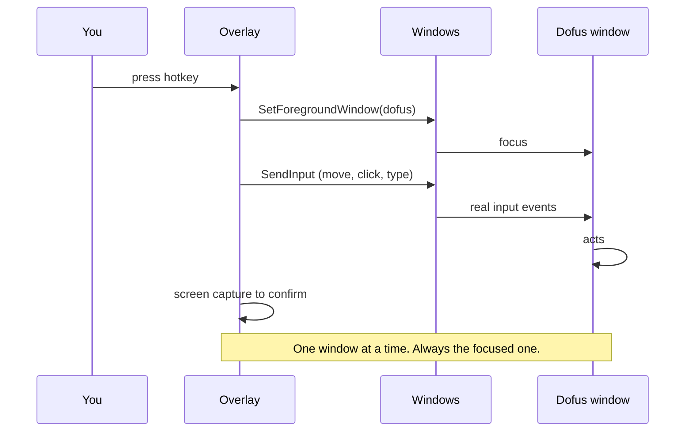

# Reading the screen and sending input on Windows

## The hard constraint: Unity needs focus

This is the single fact that shapes the whole design.

Dofus 3 is a Unity game. Unity reads input through the OS input stack, not
through window messages. So:

- **`SendInput` works.** It injects at the system input queue level, so the
  focused window receives it exactly as if a real mouse or keyboard produced it.
  It goes to whatever window has focus, and only that one.
- **`PostMessage` / `SendMessage` mostly do not work.** They deliver a window
  message that Unity's input system never reads. This is why background input to
  Unity games is unreliable to impossible.
- **Background input in general is blocked by design.** The OS treats an app
  reading keyboard input while unfocused as a keylogger. Only a narrow class of
  devices can feed an unfocused app.

**Consequence:** "one window in the foreground, everything passed through to the
other windows" is not achievable with synthetic input. You can only drive the
focused window. A broadcast tool works by rapidly focusing each window, sending,
and moving on — which is visible, slow, and looks nothing like a human.

## Reading the screen

Three options, cheapest first.

### 1. The clipboard, zero vision

`DofusHuntHelper` proves this works: read a `/travel` command from the clipboard,
move to the chat box, paste, press Enter twice. Dofus 3 also copies coordinates
to the clipboard on some interactions, and community guides in Ganymede copy the
travel command on one click.

If your data source already knows the destination, you never need to look at the
screen at all. **Start here.**

### 2. Template matching

Match a known sprite against a captured frame. The classic Dofus pixel-bot
technique, usually Python plus OpenCV.

Good for: is this dialogue box open, is this button present, is this NPC on
screen. Cheap and fast. Fragile against UI scale, resolution and theme changes.

Rust options: the `opencv` crate binds the real thing but needs a native
OpenCV install, which fights your cross-compile from WSL. `imageproc` gives
pure-Rust template matching with no native dependency and is the better default
for a Windows target built from WSL.

### 3. OCR, for text

Needed to read quest titles, objectives, dialogue and NPC names.

2026 Rust options:

| Crate | Engine | Notes |
|---|---|---|
| `ocrs` | pure Rust, own models | Explicitly good on screenshots with little preprocessing. Best default. |
| `oar-ocr` | ONNX Runtime, PP-OCR models | Highest accuracy, adds an ONNX dependency. |
| `tesseract-rs` | Tesseract | Legacy. Weaker on UI text than the above. |
| `kalosm-ocr` | Candle, TrOCR | ML-heavy, overkill here. |

The modern answer to your OpenCV question: **`ocrs` for text, `imageproc` for
templates, ONNX via `oar-ocr` only if accuracy forces it.** Skip Tesseract.

Screen capture on Windows from Rust: `windows-capture` (Windows.Graphics.Capture,
GPU path, per-window capture, works when the window is occluded) or plain BitBlt
through the `windows` crate. Prefer Graphics.Capture, it captures a specific
window rather than the screen region.

## The overlay window itself

Standard Win32 recipe, all reachable from the `windows` crate:

- `WS_EX_LAYERED` for transparency.
- `WS_EX_TRANSPARENT` for click-through, so clicks land on Dofus underneath.
- `WS_EX_TOOLWINDOW` to keep it out of Alt-Tab and the taskbar.
- `WS_EX_TOPMOST`, repositioned to follow the Dofus window rectangle.

Caveat found repeatedly: `WS_EX_LAYERED` with `LWA_COLORKEY` makes pixels look
transparent but Windows still hit-tests them as part of your window. You need
`WS_EX_TRANSPARENT` as well for genuine click-through, and you toggle it off
when you want the user to interact with the overlay.

`winit` has an open issue on click-through, so expect to call the Win32 APIs
directly rather than relying on a cross-platform crate.

## Making input look human

Directly from the detection signals in `03`:

- Randomise the click point inside the target rectangle, never the centre twice.
- Move the cursor along a path with easing, not a teleport.
- Randomise delays with a non-uniform distribution.
- Insert occasional longer pauses.
- Never run a sequence the user did not just trigger.

`DofusHuntHelper` originally used an **Arduino** to produce input at the hardware
level, below any software detection. Noted for completeness. It is unnecessary
here, since Ankama detects behaviour rather than the input API, and it adds a
hardware dependency for no gain.

## Sources

- [Send keystroke to another app without focus](https://learn.microsoft.com/en-us/answers/questions/496305/send-keystroke-to-another-app-without-focus)
- [Unity: not receiving input while focus lost](https://discussions.unity.com/t/not-receiving-input-while-focus-lost/858982)
- [elringus/UnityRawInput](https://github.com/elringus/UnityRawInput)
- [robertknight/ocrs](https://github.com/robertknight/ocrs)
- [oar-ocr](https://crates.io/crates/oar-ocr)
- [winit issue 1434: click-through windows](https://github.com/rust-windowing/winit/issues/1434)
- [Sato-Isolated/DofusHuntHelper](https://github.com/Sato-Isolated/DofusHuntHelper)
