# Where quest and map data comes from

Short answer: **all of it is available offline, in French, auto-updated on every
patch, without touching the client.** This is the strongest finding of the whole
research.

## The three sources

```mermaid
graph LR
    CDN[(Ankama cytrus CDN<br/>game files)]
    CLIENT[Dofus 3 client<br/>DataCenterModule]

    CDN --> DODUDA[doduda<br/>Go CLI, GPL-3.0]
    DODUDA --> D3M[dofus3-main<br/>auto-updated JSON releases]
    D3M --> API1[doduapi<br/>encyclopedia API]

    CLIENT --> DDC[DDC<br/>BepInEx dump, offline only]
    DDC --> DBIAPI[DBI.Api<br/>data + pathfinder + treasure solver]

    WEB[DofusDB<br/>api.dofusdb.fr] --> COMM[community JSON API]

    style CLIENT fill:#3a1111,stroke:#a33
```

### 1. doduda + dofus3-main, the primary source

`dofusdude/doduda` downloads Dofus 3 assets from Ankama and converts them to
developer-friendly JSON. Its source tree has dedicated modules for **quests**,
items, maps, images and **languages/i18n**. It unpacks natively, no Docker or
extra tooling required.

You do not need to run it. `dofusdude/dofus3-main` publishes the output as
auto-updating releases whenever a new game version ships. `dofusdude/dodumap`
maps the raw data into a more usable shape. `dofusdude/doduapi` serves the whole
thing as a versioned encyclopedia API.

License is GPL-3.0 on the tool. The data itself is Ankama's.

**Recency check:** doduda last updated 2026-07-06, 291 commits, actively
maintained. This is the one to build on.

### 2. DDC, the client-side dump

`Dofus-Batteries-Included/DDC` extracts data from the game's own
`DataCenterModule` class through a BepInEx plugin, then publishes JSON. A CI
workflow watches for game updates and re-extracts. MIT licensed, consumable as
`data.zip` GitHub releases or through `api.dofusbatteriesincluded.fr`.

Important distinction: **the injection happens on their CI machine, to produce
data. You consume the JSON.** Nothing is injected on your machine. That keeps
you clean while still benefiting from a dump that has different coverage than
doduda, because it reads the client's own resolved structures.

Last data update 2025-06-17, but `DBI.Api` was updated 2026-08-28, so the API
side is alive.

### 3. DofusDB, the community web API

`api.dofusdb.fr`. Covers items, sets, monsters, maps, dungeons, treasure hunts,
achievements, and quests including **conditions, steps and rewards**. Multi
language, French included. Query syntax is Feathers-style, for example
`?typeId[$in][]=1&$sort=-id&$skip=0`.

It is the de facto standard the whole French ecosystem reuses. It is also
unofficial, rate-limited by someone else's server, and can go away. Use it to
prototype, not as a runtime dependency.

## Is there an official Ankama API?

No. Ankama once left bestiary data open to fansites and closed it for security
reasons. It has selective partnerships instead, notably with DofusBook and
KaellyBot. `Foohx/DofusWeb-API` is an unofficial HTTP wrapper over Ankama web
services, not a game data API.

So: no official API to target, and no permission path to ask for one as an
individual.

## Pathfinding between maps

You do not need to build a world graph. `DBI.Api` exposes a **Path Finder API**
that computes paths between maps over a world graph, plus map cells, nodes and
transitions.

But with `/travel X Y` available in-game, pathfinding is mostly unnecessary. The
game walks the route itself. You need the destination coordinates, which come
from quest data, and a way to type one line.

## `/travel`, the key mechanic

Dofus 3 has built-in autopilot:

- Chat command `/travel X Y`, for example `/travel -10 10`. Community reports
  say you paste and press Enter twice.
- `CTRL + click` on a map cell also triggers autopilot movement.
- Requirement: subscribed account, level 10 minimum. It became free for all
  subscribers with Dofus 3.

This single feature removes most of what your README complains about. Travelling
between quest steps becomes: look up the coordinate, type one line.

## What is still missing

Nothing found covers these, and you will have to solve them:

1. **Which quest step am I on.** Quest definitions are available. Your live
   progress is not, without reading the client. Options: OCR the quest tracker
   panel, or have the user tick steps in the overlay.
2. **Dialogue option trees.** Whether the extracted quest data includes which
   NPC reply advances which step needs verification against an actual doduda
   dump. Check `quests.go` output before designing around it.
3. **French text mapping.** doduda has a `languages.go` module, so i18n is
   there, but confirm the French strings line up with what the client renders.

## Next concrete step

Download one `dofus3-main` release and inspect the quest JSON by hand. Everything
above hinges on how rich that file is. Do this before any design work.

## Sources

- [dofusdude/doduda](https://github.com/dofusdude/doduda)
- [dofusdude/dofus3-main](https://github.com/dofusdude/dofus3-main)
- [dofusdude/dodumap](https://github.com/dofusdude/dodumap)
- [dofusdude/doduapi](https://github.com/dofusdude/doduapi)
- [Dofus-Batteries-Included/DDC](https://github.com/Dofus-Batteries-Included/DDC)
- [Dofus-Batteries-Included/DBI.Api](https://github.com/Dofus-Batteries-Included/DBI.Api)
- [DofusDB](https://dofusdb.fr/)
- [Dofapi](https://dofapi.fr/)
- [Forum officiel: commande auto pilotage](https://www.dofus.com/fr/forum/1003-divers/2276716-commande-auto-pilotage)
- [Autopilotage gratuit avec Dofus Unity](https://guidactik.com/dofus/autopilotage-gratuit-definitivement-a-larrivee-de-dofus-2-unity/)
- [Informations sur les bases de données Ankama](https://www.dofus.com/fr/forum/1003-divers/1909600-informations-bases-donnees-ankama)
