# The 8 accounts problem

Your ask: one window in the foreground, the other 7 closed, no resource drain.
Here is what is actually possible.

## The cost today

Each Dofus 3 instance uses roughly 2 GB of RAM. Eight instances means a 16 GB
floor. Community consensus: 32 GB minimum for 8 accounts, 64 GB for comfort.

Known mitigations, all in-game:

- Enable the **multi-account optimisation** option.
- Cache quality set to very low.
- Creature mode limited to 20 characters per map.
- Disable auras, spell animations, animated scenery.
- Antialiasing off when the CPU saturates.
- Clear the game cache periodically, RAM creeps up over a session.

Ankama Launcher supports launching several instances of the same game, so
multi-instance is officially supported.

Server-side limits: 8 subscribed accounts per IP on standard servers, 4 free
accounts. Mono-account servers allow one, and Dofus Retro closed the two-per-IP
loophole.

## The three architectures

```mermaid
graph TD
    subgraph A["A. Window organizer — legal, what everyone does"]
        A1[8 clients running] --> A2[hotkey per character]
        A2 --> A3[SetForegroundWindow]
    end
    subgraph B["B. Input broadcast — grey zone"]
        B1[8 clients running] --> B2[focus, SendInput, next]
        B2 --> B3[serial, visible, slow]
    end
    subgraph C["C. Protocol client — banned, out of scope"]
        C1[1 UI] --> C2[8 protobuf connections]
        C2 --> C3[no game client at all]
    end
    style C fill:#3a1111,stroke:#a33
    style B fill:#2a2411,stroke:#aa3
    style A fill:#11291a,stroke:#3a7
```

### A. Window organizer

What ROrganizer, DofusOrganizer, Dorganize, Multifus and a dozen AutoHotkey
scripts do. Bind a key per character, bring that window forward. Tolerated for
15+ years because it only touches the Windows container, never the client.

Solves alt-tab fatigue. Solves nothing about RAM.

### B. Input broadcast

Dofus Console advertises broadcasting inputs across a multi-account team using
the native Windows API, and calls itself undetectable.

Physically, because Unity ignores `PostMessage` (see `04`), broadcast can only
work by focusing each window in turn and sending input. That is serial, visibly
flickers, and produces exactly the "same action at the same time across
accounts" pattern detection looks for. Treat vendor claims of undetectability as
marketing.

### C. Protocol-level client

`krm35/dofus-multi`, 209 stars, updated 2026-09-01, is the most popular Dofus 3
multi-account project. Node backend, browser frontend, and it ships no-anim, an
HDV bot, an FM bot and a hunt bot. It tells users to route 2 of 4 accounts
through a phone's 4G hotspot to get a second IP.

This is the only architecture that gives you 8 characters with no game windows,
because it replaces the client entirely. It is also:

- A bot by any definition. It bundles farming and trading bots.
- Exactly what the early-2026 MITM and injection detection routine targets.
- Explicitly outside your project's stated scope.
- Dependent on a deobfuscated protobuf protocol that breaks every patch.

**Recommendation: do not go here.** It contradicts the project's own README.

## What you can actually build

Ranked by value per unit of risk.

1. **Organizer plus overlay, one binary.** Hotkey switching, per-character
   labels, and the quest overlay reading whichever window is focused. Zero risk,
   solves alt-tab, and nothing on GitHub combines the two.
2. **Focused-window automation only.** The overlay acts on the character you are
   looking at. One keypress, one action, then stop. No broadcast.
3. **A launch profile manager.** Start and stop instances on demand with the
   right graphics settings per role. If only 2 of your 8 characters need to act
   right now, the other 6 do not need to be running. This is the realistic
   answer to the RAM problem, and it does not exist as a tool today.
4. **Sequenced group travel, opt-in.** You press one key, the tool focuses each
   character in turn and sends `/travel X Y` with randomised timing. One chat
   line per character instead of a full walk each. This is the grey zone from
   `03`. It is the highest-value feature and the highest-risk one. Decide
   deliberately.

## What you cannot build

- 8 characters with 7 windows closed, without replacing the client.
- Simultaneous input to unfocused Unity windows.
- Any of it on a mono-account server.

## Sources

- [Astuces pour réduire la consommation de RAM de Dofus](https://www.dofus.com/fr/forum/1087-dofus/2313094-astuces-reduire-consommation-ram-dofus)
- [Optimiser Dofus en 2020 (multicompte)](https://www.dofus.com/fr/forum/1087-dofus/2317366-optimiser-dofus-2020-win10-nvidia-multicompte)
- [Quel PC pour Dofus 2 Unity en multicompte](https://guidactik.com/dofus/dofus-2-unity-quel-pc-pour-faire-tourner-le-portage-multicompte-et-monocompte/)
- [Ankama Launcher FAQ](https://support.ankama.com/hc/en-us/articles/36995374380817-Ankama-Launcher-FAQ)
- [Loulouw/ROrganizer](https://github.com/Loulouw/ROrganizer)
- [krm35/dofus-multi](https://github.com/krm35/dofus-multi)
- [Dofus Console](https://dofus-console.com/en/)
- [Limite de connexions par IP](https://www.dofus.com/fr/forum/1103-discussions-generales/2004842-limite-nombre-connexion-ip)
