# Security audit: doduda and dofus3-main

Date: 2026-09-02. Nothing was downloaded, installed or executed. This is a read
of the published source only.

**Scope limit, stated up front.** I read the top-level files of `doduda` and the
release workflow of `dofus3-main`. I did not read every line, and I did not audit
the transitive Go dependencies or the prebuilt binaries. Treat this as "no red
flags found in the main paths", not "proven clean".

## Verdict

| Concern | Finding |
|---|---|
| Contacts websites | Yes, one: `cytrus.cdn.ankama.com`. Ankama's own CDN. Nothing obfuscated. |
| Downloads files | Yes: the Dofus game data bundles, from that CDN. |
| Executes code | **Yes, in two opt-in paths.** Docker backend and `render`. See below. |
| Keylogging | None. No input, hook, or window API anywhere. |
| Telemetry / phone-home | None found. The only POST is the `watchdog` subcommand, to a URL you supply. |
| Writes executables | None found. Output is JSON, PNG, SWF, tar.gz. |
| Obfuscated strings | None found. All URLs are plain literals. |

## What it actually does

```mermaid
graph TD
    A[cytrus.cdn.ankama.com/cytrus.json<br/>current version] --> B[/dofus/releases/RELEASE/PLATFORM/VERSION.manifest<br/>flatbuffers manifest/]
    B --> C[/dofus/bundles/XX/HASH<br/>compressed bundles/]
    C --> D{unpack backend}
    D -->|native, DEFAULT| E[pure Go<br/>lz4 + lzma + Unity typetree]
    D -->|docker, opt-in| F[pulls stelzo/doduda-umbu<br/>and stelzo/assetstudio-cli<br/>from Docker Hub]
    E --> G[(JSON on disk)]
    F --> G
    style F fill:#3a1111,stroke:#a33
    style E fill:#11291a,stroke:#3a7
```



Three URLs, all hardcoded, all on Ankama's CDN:

```
https://cytrus.cdn.ankama.com/cytrus.json
https://cytrus.cdn.ankama.com/dofus/releases/{release}/{platform}/{version}.manifest
https://cytrus.cdn.ankama.com/dofus/bundles/{hash[0:2]}/{hash}
```

That is the same CDN the Ankama Launcher uses. There is a `--full-raw` flag whose
help text says "Download the full game like the Ankama Launcher".

## The three things that do execute code

### 1. The install script — do not use it

The README's first install line is:

```
curl -s https://get.dofusdu.de/doduda | sh
```

This pipes a remote script straight into a shell. It is the single highest-risk
item in the whole project. Never run it. `go install` or building from source
avoids it entirely.

### 2. Docker backend — opt-in, but real

`unity_backend_docker.go` pulls `stelzo/doduda-umbu:{arch}` and
`stelzo/assetstudio-cli:{arch}` from Docker Hub, runs them, and **bind-mounts
your host directories** into the containers (`inputDir:/app/data`,
`outputDir:/app/AssetStudio/ASExport`). Containers use `AutoRemove: true`.

`stelzo` is the maintainer's own Docker Hub namespace. The images are third-party
binaries whose contents I have not audited.

**This is not the default.** `unity_backend.go` selects the native backend unless
the environment variable `DODUDA_UNITY_BACKEND` says otherwise. Leave it unset.

### 3. `render` subcommand — always uses Docker

`render.go` creates and starts `stelzo/swf-to-svg` and `stelzo/svg-to-png`
containers unconditionally. It also appears to download incremental updates from
GitHub releases. This path is for Dofus 2 SWF assets and you have no reason to
call it.

## The default path is clean

`unity_bundle_native.go` and `unity_i18n_native.go` are pure in-process Go. Their
complete import lists are standard library plus decompression and parsing:

```
bytes, encoding/binary, encoding/hex, encoding/json, fmt, io, os,
path/filepath, strconv, strings, unicode, unicode/utf8,
github.com/kvarenzn/ssm/uni, github.com/pierrec/lz4/v4, github.com/ulikunitz/xz/lzma
```

No `os/exec`. No `net/http`. No plugin loading. `main.go` grepped for every
network and execution keyword returns only the CLI flag definitions and the
project's own GitHub URL.

`quests.go` just names the files to pull:

```
Dofus_Data/StreamingAssets/Content/Data/data_assets_questsdataroot.asset.bundle
```

## The watchdog

`doduda watchdog` polls for a version change and POSTs to a hook URL. The URL,
the auth header and the body template are all **your** flags
(`--hook`, `--auth-header`, `--body`). It has no built-in destination. It only
runs when you invoke that subcommand.

## Dependencies worth naming

`go.mod` is 15 direct dependencies, all well-known: cobra, viper, charmbracelet
TUI, docker client, lz4, xz, flatbuffers, plus the author's own `ankabuffer`
(Ankama manifest format, 13 files) and `dodumap`. `filediver` and `ssm` do the
Unity asset parsing.

OpenTelemetry packages appear, but only as indirect dependencies pulled in by the
Docker client. No tracing is wired up in the code I read.

## dofus3-main is data, not code

The repo contains exactly three things: a LICENSE, a README, and one workflow.

The workflow runs on manual dispatch, downloads the doduda Linux binary, runs it
with `--headless --jobs 1 --dofus-version {version} --output ./data`, then
`doduda map`, tars the output by category and uploads it to a GitHub release.

Latest release: **3.6.10.11, published 2026-08-25, 188 assets.** Relevant ones:

| Asset | Size |
|---|---|
| `quests.json` | 1.1 MB |
| `maps.json` | 3.8 MB |
| `npcs.json` | 287 KB |
| `quest_images_128.tar.gz` | 6.3 MB |

**These are plain JSON files.** A `.json` file cannot execute. Fetching
`quests.json` and opening it in an editor carries no code execution risk at all.
The `.tar.gz` archives are a different matter: extracting an untrusted archive
can write outside the target directory if the extractor does not guard against
path traversal. You do not need the images, so do not extract anything.

## Can we write our own fetcher?

Yes for the download half. No, not cheaply, for the unpack half.

```mermaid
graph LR
    S1[GET cytrus.json<br/>trivial] --> S2[GET .manifest<br/>flatbuffers, schema published<br/>in ankabuffer/manifest.fbs]
    S2 --> S3[GET bundles by hash<br/>trivial]
    S3 --> S4[reassemble fragments<br/>+ lz4 / lzma decompress<br/>moderate]
    S4 --> S5[parse Unity asset bundle<br/>typetree walk<br/>HARD]
    S5 --> S6[(quests.json)]
    style S1 fill:#11291a,stroke:#3a7
    style S2 fill:#11291a,stroke:#3a7
    style S3 fill:#11291a,stroke:#3a7
    style S4 fill:#2a2411,stroke:#aa3
    style S5 fill:#3a1111,stroke:#a33
```



Steps 1 to 4 are a weekend in Rust. Step 5 is the whole problem: `doduda` leans
on `kvarenzn/ssm` and `xypwn/filediver` to walk Unity serialised type trees, and
that is what breaks whenever Unity or the game's serialisation changes. Writing
that from scratch to save one JSON download is a bad trade.

## Recommendation

Three options, cheapest first.

1. **Fetch `quests.json` alone, with curl, and read it.** 1.1 MB of plain text
   from a GitHub release URL. No archive, no binary, no execution. This is what
   you actually need to answer "how rich is the quest data". Risk: effectively
   zero.
2. **Build doduda from source and run the native backend.** `go build` from a
   cloned repo, never the `curl | sh` installer, with `DODUDA_UNITY_BACKEND`
   unset and no `render` subcommand. Risk: you are executing third-party Go you
   have not fully audited. Do it in a container or a throwaway VM if that matters.
3. **Write our own downloader.** Only worth it if we later need data doduda does
   not expose. Steps 1 to 4 above are reusable; step 5 is not worth rebuilding.

Option 1 answers the open question in `05-game-data-and-quests.md` today.

## Sources

- [dofusdude/doduda](https://github.com/dofusdude/doduda)
- [dofusdude/dofus3-main](https://github.com/dofusdude/dofus3-main)
- [dofusdude/ankabuffer](https://github.com/dofusdude/ankabuffer)
