# Rebuilding the data extractor in Rust

Verdict: **yes, and it is a good first repo for this workspace.** The download
half is small and fully specified. The unpack half is the real work, and Rust
crates already exist for it.

## How the data is actually obtained

Two independent layers. Confusing them is what makes this look hard.

```mermaid
graph TD
    subgraph L1["Layer 1 — Ankama cytrus CDN. Small, fully known."]
        A["GET cytrus.json<br/>current version per game/channel/platform"]
        B["GET dofus/releases/dofus3/windows/VERSION.manifest<br/>FlatBuffers, 5 tables"]
        C["build index: chunk hash -> bundle hash"]
        D["GET dofus/bundles/XX/HASH<br/>plain GET, no Range header"]
        E["slice bundle[chunk.offset .. +size]<br/>concatenate in order<br/>NO decompression here"]
        A --> B --> C --> D --> E
    end
    E --> F["data_assets_questsdataroot.asset.bundle<br/>byte-identical to what the game ships"]
    subgraph L2["Layer 2 — Unity. The actual work."]
        G["UnityFS header"]
        H["block info, LZ4 or LZMA"]
        I["SerializedFile + TypeTree"]
        J["walk typetree -> typed objects"]
        G --> H --> I --> J
    end
    F --> G
    J --> K[("quests.json")]

    style L1 fill:#11291a,stroke:#3a7
    style L2 fill:#2a2411,stroke:#aa3
```



### Layer 1, in full

Three URLs. All hardcoded, all plain, all on Ankama's own CDN.

```
https://cytrus.cdn.ankama.com/cytrus.json
https://cytrus.cdn.ankama.com/dofus/releases/{release}/{platform}/{version}.manifest
https://cytrus.cdn.ankama.com/dofus/bundles/{hash[0:2]}/{hash}
```

The manifest is FlatBuffers. The whole schema is five tables:

```
Chunk    { hash: [ubyte], size: long, offset: long, done: bool }
File     { name: string, size: long, hash: [ubyte], chunks: [Chunk],
           executable: int8, symlink: string }
Bundle   { hash: [ubyte], chunks: [Chunk] }
Fragment { name: string, files: [File], bundles: [Bundle] }
Manifest { fragments: [Fragment] }   // root
```

Reconstruction is byte slicing, nothing more:

- A file with **no chunks** lives whole inside one bundle. Find the bundle whose
  chunk hash equals the file hash, take `bundle[chunk.offset .. +chunk.size]`.
- A **chunked** file: for each of its chunks, find the bundle holding that chunk
  hash, slice it out, then append the slices in the file's chunk order.

There is **no compression and no archive format at this layer.** Confirmed by
reading `update.go`. That is why this half is easy.

You only download the bundles that hold the files you asked for. For quests that
is one game path:

```
Dofus_Data/StreamingAssets/Content/Data/data_assets_questsdataroot.asset.bundle
```

### Layer 2, honestly

The reconstructed file is a standard Unity `UnityFS` asset bundle: header, a
compressed block-info table, data blocks compressed with **LZ4 or LZMA**, then a
`SerializedFile` containing objects plus a **type tree** describing their layout.
Producing JSON means walking that type tree.

The Go tool does this in one file, `unity_bundle_native.go`, leaning on
`lz4`, `xz/lzma` and `kvarenzn/ssm/uni` for the type tree walk.

## Rust crates that already cover layer 2

| Crate | Covers | Note |
|---|---|---|
| `unity-asset` | UnityFS bundles, SerializedFile, TypeTree, dynamic object reading, compression | Most complete. Still 0.x. |
| `unity-asset-binary` | `.bundle`, `.unity3d`, `.assets`, UnityFS | Companion crate |
| `io_unity` | UnityFS + SerializedFile, can use external typetree JSON when the file has none | Useful fallback |
| `urex` | WebFile, SerializedFile | Narrower |

Layer 1 needs only `reqwest`, `flatbuffers`, `serde_json`. No native deps, so it
cross-compiles from WSL to Windows cleanly.

## The one thing that decides easy or hard

**Do the Dofus 3 data bundles ship a type tree?**

- If yes, a generic typetree walk produces JSON with no game-specific knowledge.
  `unity-asset` does this out of the box and the project is a few weeks.
- If no, stripped by the IL2CPP release build, you need type definitions
  recovered from the client's IL2CPP metadata. That is a different, much larger
  project, and it breaks on every patch.

Evidence points to yes: doduda's native backend produces JSON without any
IL2CPP dumping step anywhere in its source or its CI workflow. Not verified.
**Verify this before committing to the project.** The check is to parse one
bundle header and look for the type tree, nothing more.

## Proposed repo

First repo of the workspace. Name: `dofus-data`. Rust. Hexagonal per the
workspace convention.

```
cmd/                     src/bin/dofus-data.rs
adapter/cytrus_adapter    HTTP client for the three CDN URLs
adapter/manifest_adapter  FlatBuffers manifest parse + chunk index
adapter/bundle_adapter    UnityFS unpack via unity-asset
adapter/store_adapter     write JSON to disk, cache by version
controller/extract        pick files, resolve bundles, reconstruct, unpack
driver/cli                subcommands: version, list, fetch, unpack
types/manifest_types      Chunk, File, Bundle, Fragment, Manifest
types/game_types          Quest, QuestStep, Map, Npc
```

Why this is a good first repo:

- Self-contained. No overlay, no Windows APIs, no game running.
- Every other part of the project depends on its output.
- Layer boundaries fall out naturally, so it exercises the workspace conventions.
- Testable offline. Save one manifest and one bundle as fixtures, the whole
  pipeline unit-tests with no network.
- Zero ban risk. It never touches the client or the game servers.

## Milestones

1. **Spike, half a day.** Parse a saved bundle header, confirm a type tree is
   present. Go or no-go for everything below.
2. Layer 1 end to end: version, manifest, chunk index, reconstruct one file.
   Verify the reconstructed bytes match the manifest's file hash.
3. Layer 2 via `unity-asset`: bundle to typed objects to JSON.
4. Map raw objects into `types/game_types`, French strings included.
5. Cache by game version, re-extract only when `cytrus.json` changes.

## Risks

- **No type tree** — the go or no-go above.
- **Crate maturity.** Every Rust Unity crate is 0.x. Budget for reading their
  source, and for patching.
- **Format drift.** Ankama can change cytrus or the Unity version. Layer 1 is
  cheap to fix, layer 2 is not.
- **Licensing.** doduda is GPL-3.0. Reading it for protocol understanding is
  fine. Copying its code makes this repo GPL-3.0 too. Write from the format
  description, not from their source.
- **The data is Ankama's.** Extract it, do not redistribute it.
